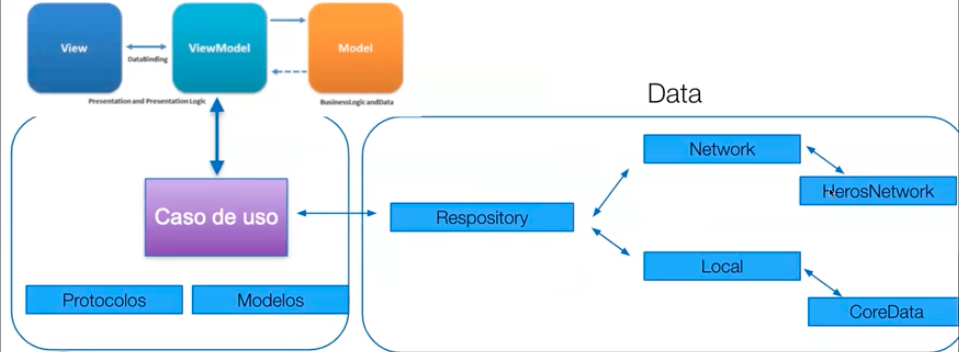

<h1 align="center">
  <strong>Marvel App 🦸🏻‍♂️ UIKit + Combine</strong>
</h1>

---

  <strong>Proyecto personal</strong>

---

  <strong>Autor:</strong> Salva Moreno Sánchez

  

## Índice
 
* [Herramientas](#herramientas)
* [Proyecto: Marvel App 🦸🏻‍♂️ UIKit + Combine](#proyecto)
	* [Descripción](#descripcion)
	* [Arquitectura](#arquitectura)
	* [Diseño](#diseno) 
	* [Programación reactiva con Combine](#combine)
	* [Gestión asíncrona con `async/await`](#asincrono)

## Herramientas

  
 
  
 
  

## Proyecto: Marvel App 🦸🏻‍♂️ UIKit + Combine

### Descripción

### Arquitectura

Según [uncle Bob's Clean Architecture pattern](https://blog.cleancoder.com/uncle-bob/2011/11/22/Clean-Architecture.html), se puede dividir el código en 3 capas:

* *Presentation*: todo el código que depende del *framework*. *Views, ViewModels, ViewControllers*, etc.
* *Data*: todo el código que interactúa con los repositorios (como llamadas a red, llamadas a la base de datos, valores predeterminados de usuario, etc.).
* *Domain*: todos los modelos de datos.

Además de seguir las indicaciones del citado Robert Cecil Martin, experto ingeniero de *software*, he concretdo la organización de mi código como se observa en la siguiente imagen:

De esta forma, conseguimos:

* **Separación de responsabilidades:** esto facilita la resolución de numerosos problemas de desarrollo y hace que una aplicación sea más fácil de probar, mantener y evolucionar.
* **Reducción de la lógica de negocio:** se reduce la cantidad de lógica de negocio requerida en el código detrás de ella.
* **Facilita las pruebas unitarias:** aunque en este caso no se han añadido *tests*, realizar la arquitectura como se indica facilita la inyección de dependencias con casos *fake*, por ejemplo. Incluso nos podría servir para diseñar nuestras pantallas sin realizar llamadas a la API.
* **Independencia de componentes:** se trabajar de forma independiente y simultánea en los componentes durante el desarrollo.
* **Reutilización de código:** mantiene una separación limpia entre la lógica de la aplicación y la UI, lo que puede mejorar significativamente las oportunidades de reutilización de código.

Debemos destacar el rol del *respository*, el cual es el responsable de manejar las operaciones de datos. Puede interactuar con diferentes fuentes de datos como “Local” (CoreData, por ejemplo) o “Network” (API, por ejemplo).

### Diseño

Como inspiración, he partido del **[concepto creativo y prototipo](https://dribbble.com/shots/2671572-Marvel-App/attachments/537660?mode=media)** del usuario llamado [Luis Herrero](https://dribbble.com/luisherrero) encontrado en la web [Dribbble](https://dribbble.com/shots/22234085-Dragon-Ball-Z-Character-Info), punto de partida que me ha ayudado para comenzar este proyecto.

### Programación reactiva con Combine

He empleado el *framework* **Combine** para gestionar flujos de datos asíncronos y eventos en la aplicación. Combine **facilita la composición y gestión de secuencias de eventos**, proporcionando operadores para transformar, combinar y manipular datos de manera declarativa. Este enfoque funcional **simplifica la lógica de manejo de eventos** y permite una **programación reactiva más eficiente**.

### Gestión asíncrona con `async/await`

Se han implementado llamadas asíncronas utilizando las funciones `async` y `await`. Esta característica, introducida en ***Swift 5.5***, me ha posibilitado **simplificar la escritura** de código asíncrono al permitir que las funciones asíncronas se vean y se utilicen de manera similar a las funciones síncronas. Además, al emplear `async/await`, las operaciones asíncronas se desarrollan de manera más clara y concisa, mejorando la legibilidad del código.

---

[Subir ⬆️](#top)

---
